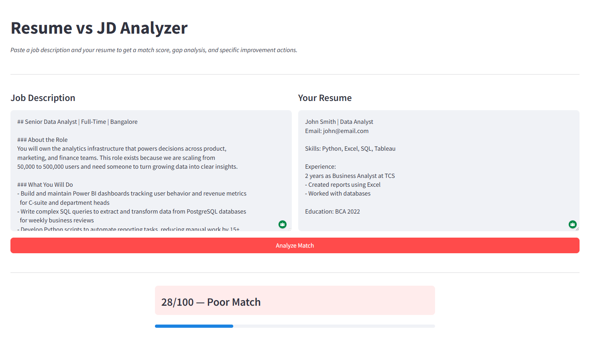
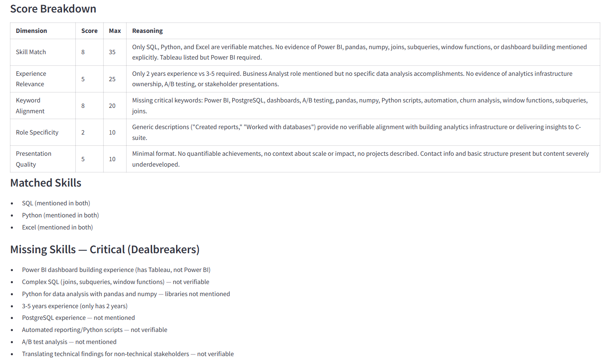
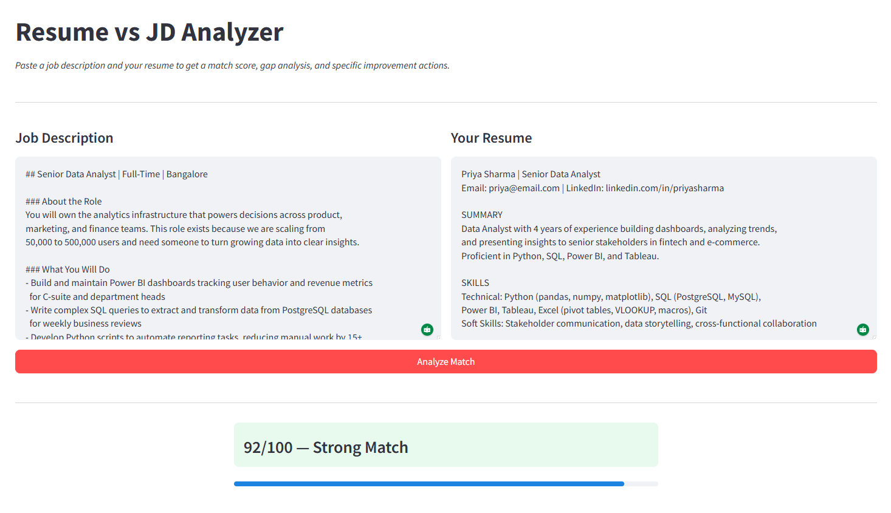
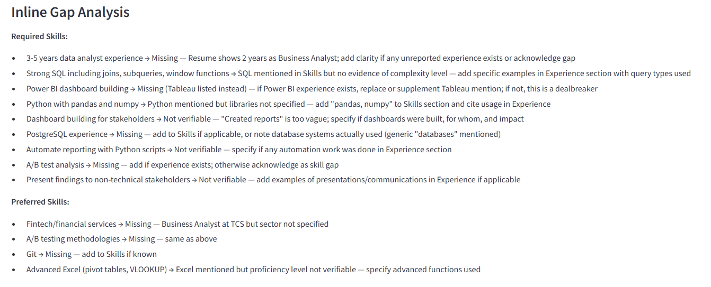
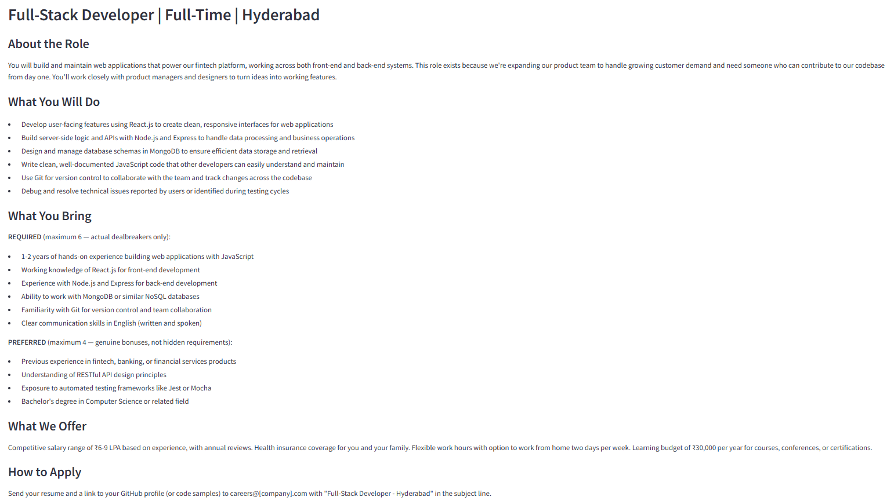
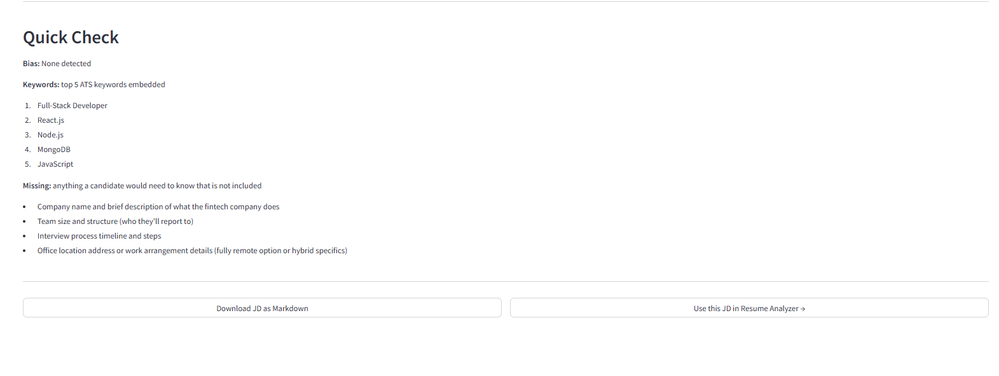
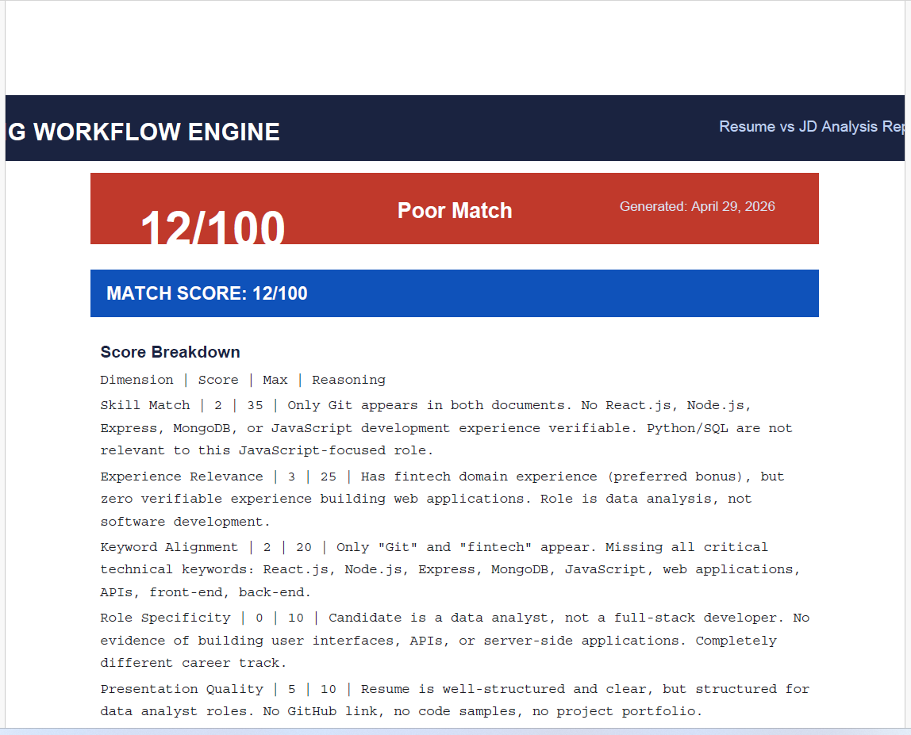

<h1 align="center">AI Resume Analyzer & Hiring Workflow Tool</h1>

<p align="center">
  <b>Python + Streamlit + Claude API | Built on Structured Prompt Engineering</b><br>
  <sub>Paste a JD and resume — get a match score, inline gap analysis, and specific improvement actions in seconds</sub>
</p>

<p align="center">
  
  
  
  
  
</p>

---

## The Problem

Job seekers get rejected by ATS systems without knowing why. Recruiters spend 5-10 minutes per resume doing a comparison that could take 5 seconds. Companies write vague JDs that attract the wrong candidates.

This tool fixes all three in one place.

---

## The Proof — 28 vs 92 on the Same JD

The same job description was tested against a weak resume and a strong resume.

**Weak resume — 28/100 Poor Match:**





**Strong resume — 92/100 Strong Match:**



64 points difference. Same JD. Same candidate background. Different language, structure, and keyword alignment. The system shows exactly what separates the two.

---

## Who This Is For

- **Job seekers** who want to know exactly why their resume is not getting callbacks
- **Recruiters** who want faster, consistent resume screening with a structured score
- **Hiring teams** who want ATS-optimized job descriptions without copy-pasting old ones

---

## Why Not Just Use ChatGPT?

Most people think they can paste a resume into ChatGPT and get the same result. They cannot.

| Feature | ChatGPT | This Tool |
|---|---|---|
| Consistent scoring structure | No — output varies every run | Yes — weighted dimension table |
| Hallucination prevention | No — invents missing skills | Yes — strict rules enforced in prompt |
| Inline gap per skill | No — generic feedback | Yes — found in which section OR where to add |
| Before/after examples | Rarely | Yes — every action has one |
| Downloadable PDF report | No | Yes |
| Bias-free JD generation | No | Yes — banned words list enforced |

The difference is not the model. It is how the prompt is engineered.

---

## Module 1 — Resume vs JD Analyzer *(Main Feature)*

Paste a JD and a resume. Get:

- Match score 0-100 with color coding (red / yellow / green)
- Weighted dimension breakdown with reasoning
- Skill match chips — green for matched, red for missing critical, yellow for missing preferred
- Inline gap analysis — per skill found or missing with where to add it
- Top 5 improvement actions with before/after examples
- One resume section fully rewritten to match the JD
- Honest assessment — direct verdict, no softening
- Downloadable PDF report

### Inline Gap Analysis — The Killer Feature



Not just "you are missing Power BI." It says "Power BI is missing — add it to your Skills section and mention it in your Analytics Engineer role." That specificity is what makes the output actionable.

---

## Module 2 — JD Generator *(Supporting Feature)*

Fill in 7 fields. Get a structured, bias-free, ATS-optimized job description.





Every JD includes a built-in Quick Check — bias scan, top 5 ATS keywords embedded, and missing information flagged. The generated JD passes directly into the Resume Analyzer with one click.

---

## Downloadable PDF Report



Full analysis exported as a formatted PDF — match score, breakdown, gap analysis, improvement actions, section rewrite, and honest assessment. Useful for candidates to track progress or recruiters to attach to candidate records.

---

## Prompt Engineering — V1 to V3

This project shows real prompt engineering — not theory. Three prompt versions for each module, each with documented failures and specific fixes.

### Resume Analyzer Evolution

**V1 — Basic:**
```
Compare this resume with this JD. Give a score out of 100.
```
Failed: single number, no explanation, inconsistent, hallucinated skills not in either document.

**V2 — Structured:**
```
You are a recruiter. Provide: score, matched skills, missing skills, 3 suggestions.
```
Improved: structure added. Still failed: generic suggestions, no dimension breakdown, model still invented skills.

**V3 — Final:**
Added strict hallucination rules, weighted dimension table, Critical vs Preferred skill split, inline gap per skill, before/after required in every action, direct honest assessment forced.

### JD Generator Evolution

**V1 failed:** Used "rockstar" and "ninja", 15 unordered requirements, different structure every run.

**V2 improved:** Persona, sections, professional tone. Still failed: no bias prevention, no bullet count.

**V3 fixed:** Banned words list, exactly 6 bullets enforced, Required max 6 / Preferred max 4, built-in self-evaluation.

Full prompt files are in the `prompts/` folder — V1, V2, V3 for both modules.

---

## Edge Case Handling

| Scenario | Response |
|---|---|
| Empty JD | Error: Please paste a job description |
| Empty resume | Error: Please paste your resume |
| Resume under 30 words | Error: Resume too short |
| Resume over 3000 words | Warning: Consider trimming to 2 pages |
| Non-English text | Notice: Analysis may be less accurate |
| Vague JD | Notice: Analysis focuses on experience alignment |

---

## How to Run This

```bash
git clone https://github.com/analytics-ak/ai-hiring-workflow-engine.git
cd ai-hiring-workflow-engine
pip install -r requirements.txt
# Add ANTHROPIC_API_KEY to .env
python -m streamlit run app.py
```

Test immediately using the sample files in `sample_data/`:
- `sample_jd_good.txt` + `sample_resume_weak.txt` → expect ~28/100
- `sample_jd_good.txt` + `sample_resume_strong.txt` → expect ~92/100

---

## Project Structure

```
ai-hiring-workflow-engine/
├── app.py                        <- Streamlit entry point
├── modules/
│   ├── jd_generator.py           <- JD Generator + V3 prompt
│   └── resume_analyzer.py        <- Resume Analyzer + V3 prompt
├── prompts/
│   ├── jd_v1.txt / v2.txt / v3.txt
│   └── resume_v1.txt / v2.txt / v3.txt
├── utils/
│   ├── report_generator.py       <- PDF generation
│   └── scorer.py                 <- JD quality scoring
├── sample_data/                  <- 4 demo files for testing
├── screenshots/                  <- app screenshots
├── .env                          <- API key — gitignored
├── requirements.txt
└── README.md
```

---

## Skills Demonstrated

**Prompt Engineering** — V1 to V3 evolution with documented failures, measurable improvements, real output comparisons. Strict hallucination prevention. Structured output enforcement.

**Streamlit Development** — Multi-page app, session state for cross-module data passing, color-coded UI, progress bars, download buttons.

**Product Thinking** — Two modules connected by workflow. JD Generator output feeds directly into Resume Analyzer. Every feature designed around how users actually work.

**PDF Generation** — In-memory PDF with ReportLab, color-coded score card, structured sections, served as download without saving to disk.

---

## Tech Stack

| Tool | Purpose |
|---|---|
| Python | Core language |
| Streamlit | Web UI |
| Anthropic SDK — claude-sonnet-4-5 | AI analysis and generation |
| ReportLab | PDF report generation |
| python-dotenv | API key management |

---

## Limitations

- Scoring may vary slightly between runs — it is a guide, not a definitive pass/fail
- Analysis quality depends on how clearly the JD and resume are written
- Uses rule-based prompt engineering — does not learn from previous analyses

---

## Future Modules

- Module 3 — Resume Optimizer (full resume rewrite for target JD)
- Module 4 — Candidate Communication (rejection and shortlist emails)
- Module 5 — HR Tools (performance reviews, escalation reports)

---

## Author

**Ashish Kumar Dongre**

[LinkedIn](https://www.linkedin.com/in/ashish-kumar-dongre-742a6217b/) | [GitHub](https://github.com/analytics-ak)
